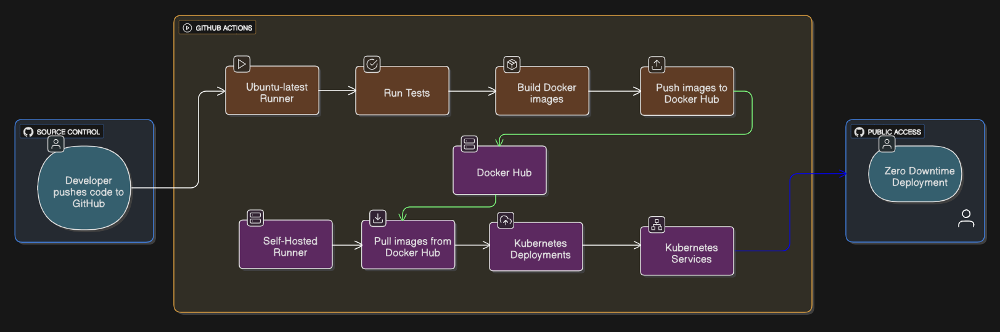

# Todo App with CI/CD

A containerized todo application with automated CI/CD pipeline deployed on Kubernetes.

##  Tech Stack

**Frontend**: HTML, CSS, JavaScript + Nginx  
**Backend**: Flask + MongoDB  
**Infrastructure**: Kubernetes, Docker, GitHub Actions  

##  Quick Start

Access the application at: `http://<your-public-ip>:30080`

## 🔄 CI/CD Pipeline

### Workflows

**1. Build & Push (`.github/build-push.yml`)**
- **Runner**: ubuntu-latest
- **Actions**: Test → Build → Push to Docker Hub

**2. Deploy (`.github/deploy.yml`)**
- **Runner**: Self-hosted
- **Action**: Deploy to Kubernetes

### Pipeline Flow
1. Code push triggers testing
2. Docker images built and pushed to Docker Hub
3. Self-hosted runner deploys to K8s cluster

## 🌐 Services

- **Frontend**: NodePort service (30080) → Public access
- **Backend**: ClusterIP service → Internal API
- **Database**: MongoDB pod

## 🔧 Environment Setup

For self-hosted runner setup and infrastructure provisioning, see: [Infrastructure Repo](https://github.com/yaswanth-mitta/Hack-Terraform)

## 📊 Architecture Diagram

